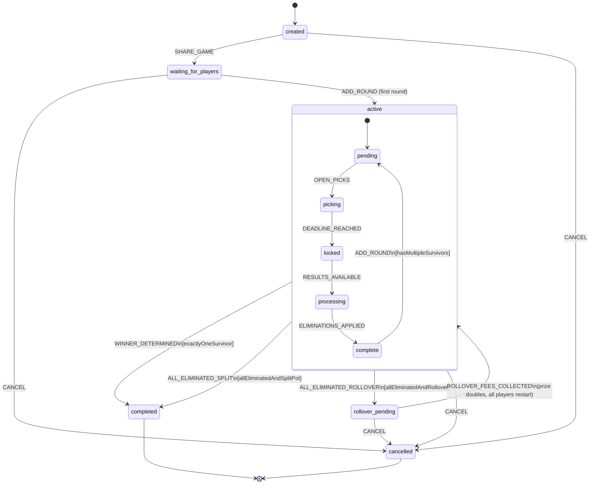
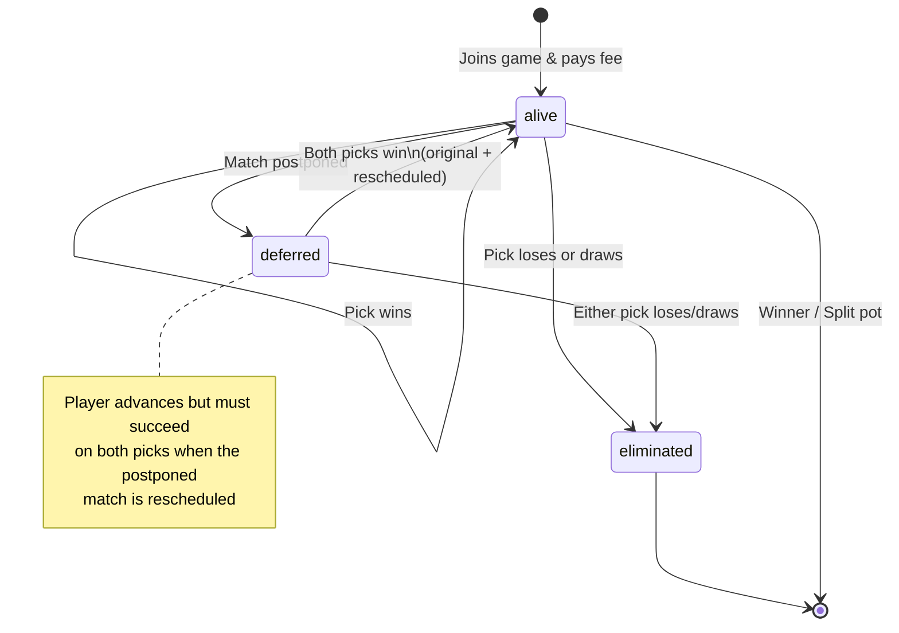
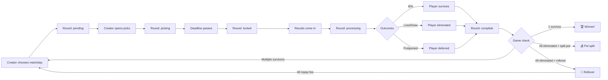

# Last Player Standing — Game State Diagram

## Game Lifecycle

Mermaid source

## Player Status Flow

Mermaid source

## Round Lifecycle Detail

Mermaid source

## State Reference

| Game State | Description |
|---|---|
| `created` | Game set up, not yet shared |
| `waiting_for_players` | Players joining via PIN/link |
| `active` | Rounds in progress |
| `completed` | Winner or split pot |
| `rollover_pending` | Collecting repayment fees |
| `cancelled` | Game cancelled |

| Round State | Description |
|---|---|
| `pending` | Matchday chosen, picks not open |
| `picking` | Players choosing teams |
| `locked` | Deadline passed, matches playing |
| `processing` | Results in, calculating |
| `complete` | Eliminations done |
